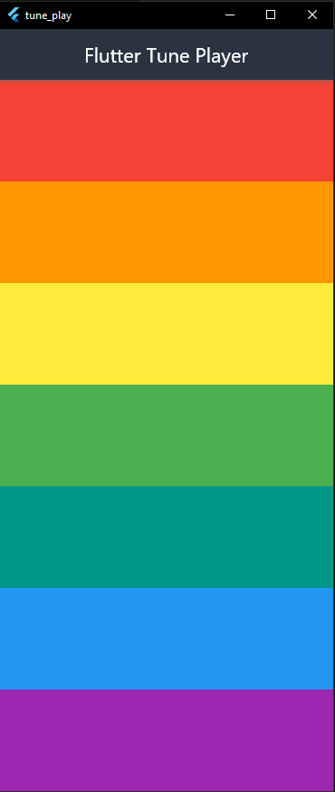
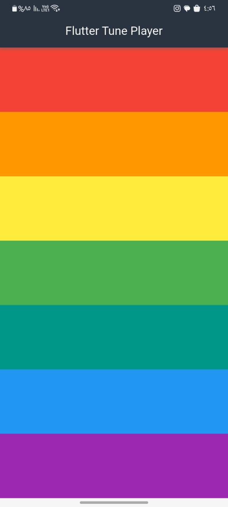
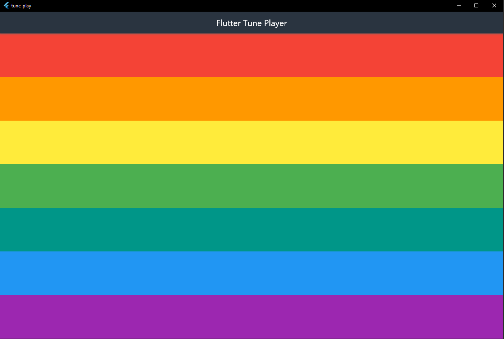

# 🎵 Flutter Tune Player

A simple yet delightful Flutter app that lets you play musical notes by tapping colorful interactive bars.


## ✨ Features

- 🎶 Play 7 distinct musical notes
- 🎨 Beautiful color-coded UI
- ⚡ Instant sound feedback
- 📱 Responsive design for all devices
- 🌐 Full cross-platform support

## 📱 Supported Platforms

| Platform | Support |
|----------|---------|
| Android  | ✅ Fully Supported |
| iOS      | ✅ Fully Supported |
| Web      | ✅ Fully Supported |
| Windows  | ✅ Fully Supported |
| Linux    | ✅ Fully Supported |
| macOS    | ✅ Experimental |

## 🖼️ Screenshots

<p float="left">
  
  
  
</p>

## 🛠️ Technical Stack

- **Framework**: Flutter 3.0+
- **Language**: Dart 2.17+
- **Audio Engine**: [audioplayers](https://pub.dev/packages/audioplayers)
- **State Management**: Built-in setState
- **Dependency Management**: Pub

## 🚀 Getting Started

### Prerequisites

- Flutter SDK (v3.0 or higher)
- Dart SDK
- IDE (VS Code or Android Studio recommended)
- Physical device or emulator

### Installation

1. Clone the repository:
```bash
git clone https://github.com/santosxxdev/tune_play.git
cd tune_play
```

## 📄 License

 - This project is open source and free to use for personal or educational purposes.
